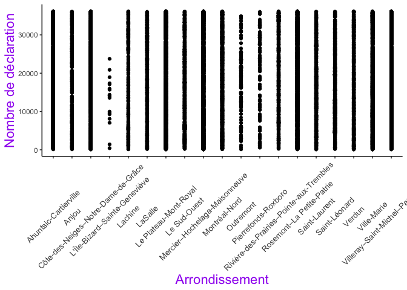
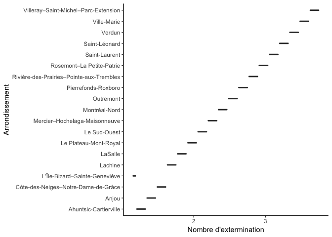

Import the dataset into R studio 

Downloaded the csv file on Montreal city website 
Saved and placed within the "01_Levet" folder on the desktop


```r
library(readxl) #fast excel reader
# import the data in R with file.choose 
Punaise_data <-read.csv("/Users/marielevet/Desktop/01_Levet/Punaise_Data.csv") # cheated with the path because I could not find another way to import the csv file. 
```


```r
library (tidyr) # restructuring the data
library (dplyr) # doing calculation with the data 
```

```
## 
## Attaching package: 'dplyr'
```

```
## The following objects are masked from 'package:stats':
## 
##     filter, lag
```

```
## The following objects are masked from 'package:base':
## 
##     intersect, setdiff, setequal, union
```

```r
library (ggplot2) # plot/visualise the data
library (magrittr) # to use the pipping function 
```

```
## 
## Attaching package: 'magrittr'
```

```
## The following object is masked from 'package:tidyr':
## 
##     extract
```

Exploring and restructuring the data 


```r
#exploring the data
attach(Punaise_data) # to ease the manipulation with the data
View(Punaise_data) # to visualise the dataset
head (Punaise_data) # to see the first few rows of the data
```

```
##   NO_DECLARATION    DATE_DECLARATION DATE_INSP_VISPRE NBR_EXTERMIN
## 1           4254 2012-10-28T16:36:04        9/21/2012            1
## 2            830 2011-09-16T09:45:58        7/13/2011            1
## 3           1380 2011-11-08T14:01:04        11/2/2011            1
## 4            455 2011-08-10T09:53:47         8/9/2011            1
## 5           1243 2011-10-26T10:11:32        9/16/2011            1
## 6           4331 2012-11-08T14:23:14       10/10/2012           NA
##   DATE_DEBUTTRAIT DATE_FINTRAIT No_QR         NOM_QR
## 1       9/21/2012     9/21/2012    24     Beaurivage
## 2       7/27/2011     8/17/2011    50    Saint-Henri
## 3       11/7/2011    11/21/2011    30   Sainte-Marie
## 4        8/9/2011      8/9/2011    44  Upper Lachine
## 5       10/5/2011     10/5/2011    19    Petite-Côte
## 6                                  20 Marie-Victorin
##                            NOM_ARROND  COORD_X COORD_Y LONGITUDE LATITUDE
## 1       Mercier–Hochelaga-Maisonneuve 303753.6 5049836 -73.51341 45.58843
## 2                        Le Sud-Ouest 298119.8 5036964 -73.58544 45.47257
## 3                         Ville-Marie 300294.9 5042372 -73.55767 45.52125
## 4 Côte-des-Neiges–Notre-Dame-de-Grâce 296046.9 5036495 -73.61194 45.46833
## 5           Rosemont–La Petite-Patrie 299524.2 5045640 -73.56757 45.55065
## 6           Rosemont–La Petite-Patrie 298622.2 5047041 -73.57914 45.56326
```

```r
summary(Punaise_data) # to get an idea of the stats on the dataset 
```

```
##  NO_DECLARATION             DATE_DECLARATION  DATE_INSP_VISPRE
##  Min.   :  104   2018-06-18T15:32:12:    4   6/13/2018:   53  
##  1st Qu.: 9106   2013-06-13T16:38:56:    3   9/9/2015 :   52  
##  Median :18120   2016-04-03T10:00:28:    3   7/30/2018:   48  
##  Mean   :18138   2018-06-18T15:32:13:    3   7/9/2018 :   45  
##  3rd Qu.:27164   2019-02-11T13:48:30:    3   6/14/2017:   44  
##  Max.   :36154   2019-03-26T13:22:21:    3   6/17/2013:   44  
##                  (Other)            :35344   (Other)  :35077  
##   NBR_EXTERMIN     DATE_DEBUTTRAIT     DATE_FINTRAIT       No_QR      
##  Min.   :1.000             : 2297             : 2297   30     : 1933  
##  1st Qu.:1.000   7/30/2018 :   52   7/30/2018 :   51   28     : 1267  
##  Median :1.000   10/3/2016 :   41   2/24/2014 :   42   13     : 1260  
##  Mean   :1.511   9/4/2018  :   41   9/15/2015 :   42   11     : 1211  
##  3rd Qu.:2.000   10/14/2016:   40   10/14/2016:   39   31     : 1009  
##  Max.   :4.000   6/13/2013 :   40   7/3/2014  :   39   18     :  979  
##  NA's   :2297    (Other)   :32852   (Other)   :32853   (Other):27704  
##             NOM_QR                                     NOM_ARROND   
##  Sainte-Marie  : 1933   Rosemont–La Petite-Patrie           : 4509  
##  Maisonneuve   : 1267   Villeray–Saint-Michel–Parc-Extension: 4495  
##  Crémazie      : 1260   Mercier–Hochelaga-Maisonneuve       : 4453  
##  Parc-Extension: 1211   Le Plateau-Mont-Royal               : 3928  
##  Lorimier      : 1009   Ville-Marie                         : 3614  
##  Vieux-Rosemont:  979   Côte-des-Neiges–Notre-Dame-de-Grâce : 3026  
##  (Other)       :27704   (Other)                             :11338  
##     COORD_X          COORD_Y          LONGITUDE         LATITUDE    
##  Min.   :274266   Min.   :5030733   Min.   :-73.89   Min.   :45.42  
##  1st Qu.:294884   1st Qu.:5041978   1st Qu.:-73.63   1st Qu.:45.52  
##  Median :297707   Median :5044165   Median :-73.59   Median :45.54  
##  Mean   :297113   Mean   :5044153   Mean   :-73.60   Mean   :45.54  
##  3rd Qu.:299709   3rd Qu.:5046513   3rd Qu.:-73.57   3rd Qu.:45.56  
##  Max.   :306022   Max.   :5062064   Max.   :-73.48   Max.   :45.70  
## 
```

```r
#restructuring the data
 Punaise_data2 <- Punaise_data[complete.cases(Punaise_data), ] # removing NA's from the dataset
 View(Punaise_data2) # double check that the NA's are gone
 attach (Punaise_data2)
```

```
## The following objects are masked from Punaise_data:
## 
##     COORD_X, COORD_Y, DATE_DEBUTTRAIT, DATE_DECLARATION,
##     DATE_FINTRAIT, DATE_INSP_VISPRE, LATITUDE, LONGITUDE,
##     NBR_EXTERMIN, NO_DECLARATION, No_QR, NOM_ARROND, NOM_QR
```

```r
 Punaise_data2 <- select (Punaise_data2, - COORD_X, - COORD_Y, - LONGITUDE, - LATITUDE) # create a subtract of dataset with columns of interest 
```

Plotting the data 
  

```r
# ploting the number of declarations per arrondissement to see the differences between area of the city 

ggplot(Punaise_data, aes (x = NOM_ARROND, y = NO_DECLARATION)) + 
  geom_point() +
  theme_classic() + # to remove the background 
  xlab ("Arrondissement") + ylab ("Nombre de déclaration") + # label x and y axes
  theme( axis.title.x = element_text(colour = "purple", 
size =rel(1.5)), axis.text.x = element_text(angle = 45, size = 10, vjust = 0.5)) + # adjust the label of the x axis to make it more visual (defined the angle, size of the title and the distance below the axis line) 
theme (axis.title.y = element_text(colour = "purple", size = rel(1.5)))
```

<!-- -->

```r
# plotting the number of extermination per arrondissements
ggplot(Punaise_data2, aes (x = NBR_EXTERMIN, y = NOM_ARROND)) +
  geom_boxplot() + 
  theme_classic() +
  xlab ("Nombre d'extermination") + ylab ("Arrondissement")
```

<!-- -->
